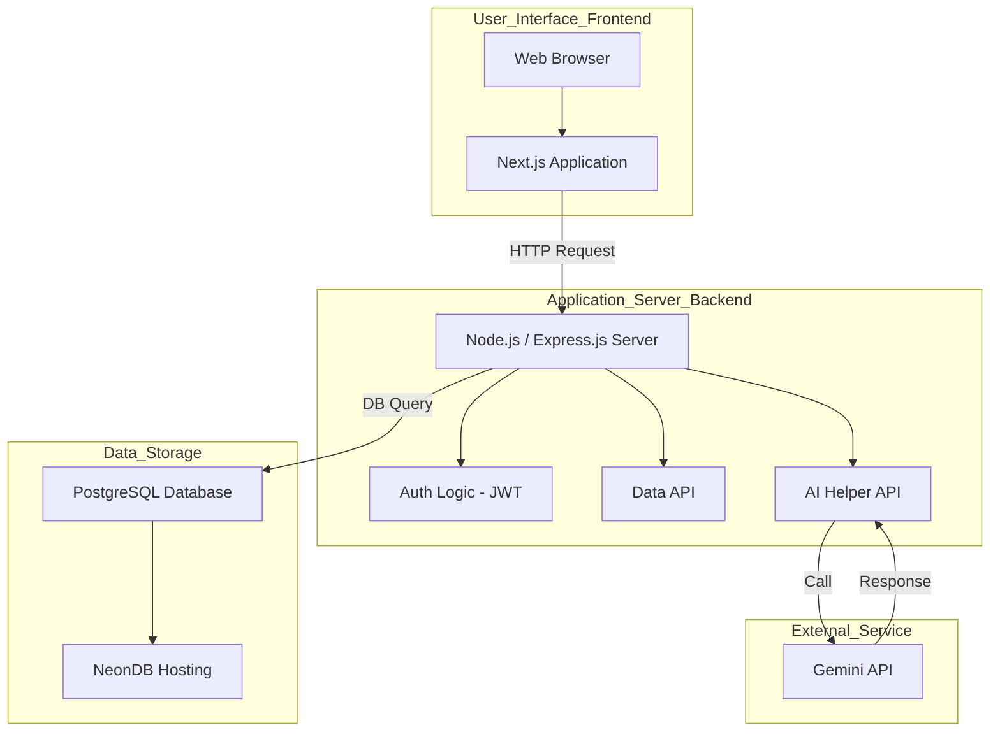

## Architectural Design

```mermaid
graph TD
    subgraph User_Interface_Frontend
        B1[Web Browser]
        B2[Next.js Application]
        B1 --> B2
    end

    subgraph Application_Server_Backend
        C1[Node.js / Express.js Server]
        C2[Auth Logic - JWT]
        C3[Data API]
        C4[AI Helper API]
        C1 --> C2
        C1 --> C3
        C1 --> C4
    end

    subgraph Data_Storage
        D1[PostgreSQL Database]
        D2[NeonDB Hosting]
        D1 --> D2
    end

    subgraph External_Service
        E1[Gemini API]
    end

    B2 -->|HTTP Request| C1
    C1 -->|DB Query| D1
    C4 -->|Call| E1
    E1 -->|Response| C4
```

## Arsitketural db

