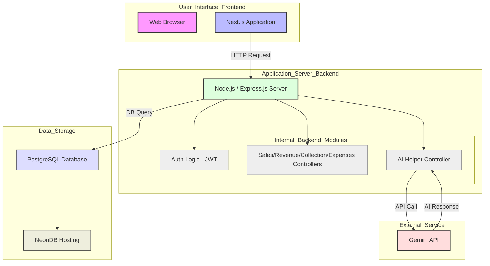

gaperlu pake CD, gada vps T_T

# arsitektur design backend:

```mermaid
graph TD
    subgraph User_Interface_Frontend
        B1[Web Browser]
        B2[Next.js Application]
    end

    subgraph Application_Server_Backend
        C1[Node.js / Express.js Server]
        subgraph Internal_Backend_Modules
            C2[Auth Logic - JWT]
            C3[Sales/Revenue/Collection/Expenses Controllers]
            C4[AI Helper Controller]
        end
        C1 --> C2
        C1 --> C3
        C1 --> C4
    end

    subgraph Data_Storage
        D1[PostgreSQL Database]
        D2[NeonDB Hosting]
        D1 --> D2
    end

    subgraph External_Service
        E1[Gemini API]
    end

    B2 -->|HTTP Request| C1

    C1 -->|DB Query| D1
    C4 -->|API Call| E1
    E1 -->|AI Response| C4

    style B1 fill:#f9f,stroke:#333,stroke-width:2px
    style B2 fill:#bbf,stroke:#333,stroke-width:2px

    style C1 fill:#dfd,stroke:#333,stroke-width:2px
    style C2 fill:#eee,stroke:#999,stroke-width:1px
    style C3 fill:#eee,stroke:#999,stroke-width:1px
    style C4 fill:#eee,stroke:#999,stroke-width:1px

    style D1 fill:#ddf,stroke:#333,stroke-width:2px
    style D2 fill:#eed,stroke:#333,stroke-width:1px

    style E1 fill:#fdd,stroke:#333,stroke-width:2px
```

# swagger jsdoc

